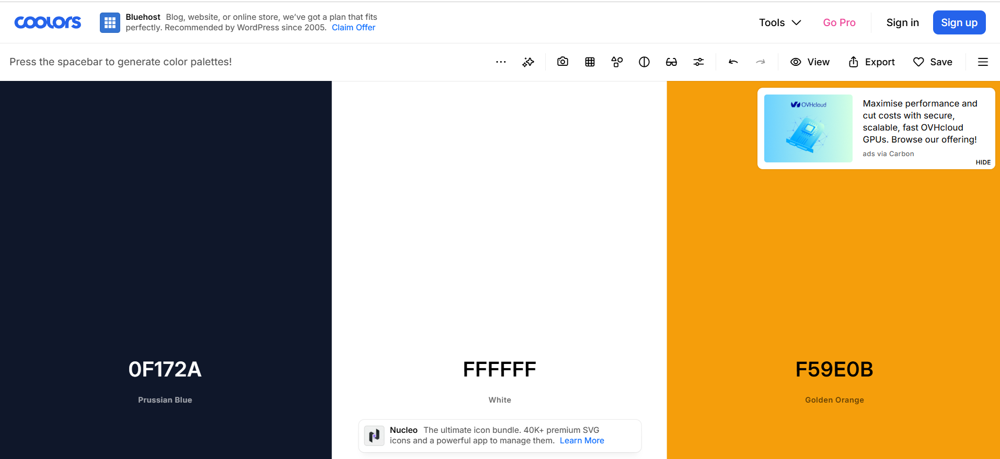
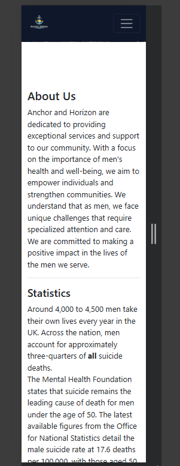
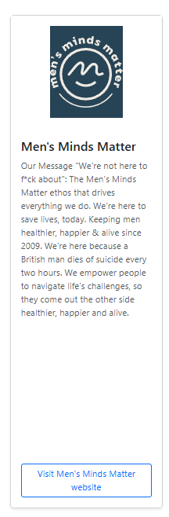

# anchor-and-horizon
# [anchor-and-horizon](https://lion695.github.io/anchor-and-horizon)

Developer: Kieron Rostill-Fellows ([lion695](https://www.github.com/lion695))

⚠️ PROJECT INTRODUCTION AND RATIONALE⚠️

This project focuses primarily on men's mental health. Statistically 1 man commits suicide every hour and this site hopes to target those men and show then that there is hope, there is a way out and there is support for them. The site will have links to various other sites of different 'themes', if you will, but the overall focus is mens mental health.

There will be a page highlighting some of the events this website organizes to help men who are facing these types of difficulties to meet up and work through it together weather it be through exercise, day trips or talking.

**Site Mockups**
*([amiresponsive](https://ui.dev/amiresponsive?url=https://lion695.github.io/anchor-and-horizon)

source: [anchor-and-horizon amiresponsive](https://ui.dev/amiresponsive?url=https://lion695.github.io/anchor-and-horizon)

## UX

### The 5 Planes of UX

#### 1. Strategy

**Purpose**
- Encourage users to visit Anchor & Horizon by showcasing its mission, community spirit, and local Events.
- Provide a seamless user experience to keep users informed and engaged.

**Primary User Needs**
- Learn about the services offered and their purpose and events.
- Sign up to the monthly newsletter and stay updated.
- Access responsive, user-friendly content.

**Business Goals**
- Increase network traffic and increase sign ups.
- Boost participation in events and social media engagement.

#### 2. Scope

**[Features](#features)** (see below)

**Content Requirements**
- Clear, motivational text about the club’s mission.
- links showcasing the community and partner sites.
- Event schedules and descriptions.
- Forms for membership sign-up.

#### 3. Structure

**Information Architecture**
- **Navigation Menu**:
  - Accessible links in the navbar.
- **Hierarchy**:
  - Clear call-to-action buttons.
  - Prominent placement of social media links in the footer.

**User Flow**
1. User lands on the home page → about us section with statistics and the sites mission.
2. Navigates to the services → sees various links to sites on different categories they can resource.
3. Views the events → sees times for events and testimonials.
4. Signs up via the membership page.

#### 4. Skeleton

**[Wireframes](#wireframes)** (see below)

#### 5. Surface

**Visual Design Elements**
- **[Colours](#colour-scheme)** (see below)
- **[Typography](#typography)** (see below)

### Colour Scheme

Colour Palette

The colour palette for Anchor & Horizon was carefully selected to reflect the website's core themes of stability, support, hope, and guidance. I decided to enter a prompt into chatGPT to gauge the best results based on the overall theme of the website. I wanted the user to feel at ease on entering the site especially considering the sensitivity of the subject matter.

Navy Blue (#0F172A / similar)

The primary colour used throughout the website is a dark navy blue. This colour was chosen because it is commonly associated with:

Trust
Reliability
Stability
Calmness

These qualities align closely with the mission of Anchor & Horizon, which aims to provide a supportive environment for men seeking information and resources related to mental health and wellbeing.

The navy blue header and navigation sections establish a professional and reassuring visual identity while maintaining strong contrast for readability.

Gold / Amber Accent (#F59E0B / similar)

A gold accent colour is used for call-to-action buttons and interactive elements.

This colour was chosen to represent:

Hope
Optimism
Direction
Positive change

The gold colour draws attention to important actions, such as signing up for updates, without overwhelming the overall design.

Additionally, the warm tone complements the sunset imagery used throughout the website, helping create a cohesive visual theme.

White (#FFFFFF)

White is used extensively throughout the website for:

Content backgrounds
Text contrast
Visual spacing

The use of white creates a clean and uncluttered appearance that improves readability and helps users focus on important information.

It also provides balance against the darker navigation and imagery elements.

Sunset Imagery

The hero image incorporates warm sunset colours including shades of orange, gold, and soft blue.

This imagery was chosen to reinforce the website's branding concept:

The anchor symbolises stability and support during difficult times.
The horizon symbolises hope, progress, and looking forward to the future.

Together, these visual elements support the overall goal of creating a welcoming and reassuring experience for visitors.

Accessibility Considerations

The colour palette was selected with accessibility in mind.

High contrast is maintained between text and background colours.
Dark navigation elements use white text to improve readability.
Call-to-action buttons are visually distinct and easily identifiable.
Colours are used to support content rather than convey meaning on their own.

This helps ensure that the website remains accessible to a broad range of users across different devices and viewing conditions.

I used [coolors.co](https://coolors.co/0f172a-ffffff-f59e0b) to generate my color palette.

- `#FFFFFF` primary text.
- `#0F172A` background color.
- `#F59E0B` brand color.

### Typography

- [Font Awesome](https://fontawesome.com) icons were used throughout the site, such as the social media icons in the footer.

## Wireframes

## User Stories

EPIC: Site Navigation
User Story #1: Responsive Navigation
User Story

As a First-Time Visitor, I need easy navigation and a user-friendly design, including a responsive layout for my device, so I can find information quickly and efficiently without frustration.

Acceptance Criteria
 The website is fully responsive across various devices and screen sizes.
 Site layout and navigation are intuitive and easy to use.
 Navigation links function correctly.
 Mobile users can access the navigation menu through a hamburger menu.
Tasks
 Apply responsive design principles using Bootstrap.
 Create desktop navigation layout.
 Create mobile navigation menu.
 Test responsiveness across multiple screen sizes.
 Verify all navigation links function correctly.
Priority

Must Have

EPIC: Mental Health Awareness
User Story #2: Understand Website Purpose
User Story

As a First-Time Visitor, I need a clear introduction to the purpose of Anchor & Horizon so that I can quickly determine whether the website is relevant to my needs.

Acceptance Criteria
 A hero section is prominently displayed on the homepage.
 The website mission is clearly communicated.
 Supporting text explains the website's purpose.
 A call-to-action is visible within the hero section.
Tasks
 Create hero section.
 Add headline and supporting text.
 Add call-to-action button.
 Test visibility on desktop and mobile devices.
Priority

Must Have

EPIC: Mental Health Awareness
User Story #3: Access Mental Health Information
User Story

As a Visitor, I want access to information and statistics regarding men's mental health so that I can better understand the challenges affecting men today.

Acceptance Criteria
 Mental health statistics are displayed.
 Information is easy to read and understand.
 Content remains accessible on all screen sizes.
Tasks
 Create statistics section.
 Research and add relevant statistics.
 Apply responsive styling.
 Test readability across devices.
Priority

Must Have

EPIC: Support Resources
User Story #4: Discover Support Organisations
User Story

As a Visitor, I want to browse trusted support organisations so that I can access additional help and guidance when needed.

Acceptance Criteria
 Resource cards are displayed.
 Each organisation includes a name and description.
 Information is clearly presented.
 Resource cards remain responsive.
Tasks
 Create resource cards.
 Add organisation names.
 Add organisation descriptions.
 Style cards for responsive layouts.
Priority

Must Have

EPIC: Newsletter Engagement
User Story #5: Subscribe for Updates
User Story

As a Visitor, I want to subscribe to updates so that I can receive future information about resources, events, and support opportunities.

Acceptance Criteria
 A signup call-to-action is visible.
 Users can access the signup form.
 Form fields are clearly labelled.
Tasks
 Create newsletter signup section.
 Add form fields.
 Style form for responsiveness.
 Test form usability.
Priority

Should Have

EPIC: Responsive Design
User Story #6: Mobile-Friendly Experience
User Story

As a Mobile User, I need the website to display correctly on my device so that I can access content easily without zooming or horizontal scrolling.

Acceptance Criteria
 Content adapts to smaller screen sizes.
 Images scale appropriately.
 Text remains readable.
 Navigation remains accessible.
Tasks
 Implement Bootstrap responsive grid system.
 Test mobile breakpoints.
 Optimise image sizing.
 Verify mobile navigation functionality.
Priority

Must Have

EPIC: Accessibility
User Story #7: Accessible Content
User Story

As a Visitor, including users with accessibility needs, I want content to be easy to read and navigate so that I can access information without barriers.

Acceptance Criteria
 Images include descriptive alt text.
 Colour contrast meets accessibility guidelines.
 Heading structure follows a logical hierarchy.
 Interactive elements are keyboard accessible.
Tasks
 Add alt attributes to all images.
 Review colour contrast.
 Verify heading structure.
 Test keyboard navigation.
Priority

Must Have

## Features

Features
Existing Features
Responsive Navigation Bar

The website includes a fully responsive navigation system that adapts to different screen sizes.

Desktop Features:

Logo and branding displayed prominently.
Navigation links provide quick access to key sections.
Dedicated "Sign Up" call-to-action button.
 Desktop view ⬆️

Mobile Features:

Navigation collapses into a hamburger menu.
Mobile-friendly layout optimised for smaller screens.
Easy access to all navigation links.
Hero Section
 

Mobile view ⬆️

Tablet view ⬆️

The homepage features a large hero banner designed to immediately communicate the purpose of the website.

Features include:

Full-width background image.
Supporting introductory text.
Call-to-action button encouraging user engagement.
Responsive design for desktop and mobile devices.

About Us Section:

The About Us section introduces visitors to the purpose and goals of Anchor & Horizon.

Features include:

Clear overview of the organisation.
Information regarding the website's mission.

Supporting imagery to enhance visual engagement.

Responsive two-column layout on larger screens.
Men's Mental Health Statistics

A dedicated section provides information and statistics relating to men's mental health.

Features include:

Educational content designed to raise awareness.
Relevant UK-focused mental health statistics.
Structured layout for readability.
Responsive formatting for smaller devices.

Resource Directory

The website provides a curated collection of external support organisations.

Featured organisations include:

Andy's Man Club

Men's Minds Matter

Fathers Guidance

Stand Easy

Features include:

Individual information cards.
Organisation branding and imagery.
Brief descriptions of available support.
Consistent card layout.
Call-to-Action Elements

Call-to-action buttons are used throughout the site to encourage user engagement.

Features include:

Dedicated Sign Up buttons.
High-contrast styling.
Consistent visual appearance across the website.
Branding and Visual Identity

A consistent visual identity has been implemented throughout the website.

Features include:

Custom Anchor & Horizon logo.

Navy blue colour palette.
Gold accent colour for interactive elements.
Anchor and horizon imagery reflecting the project's theme.
Responsive Design

The website has been designed using responsive web design principles.

I generated this image using Chat GPT to guarantee it was unique to this project. I wanted it to reflect the overall theme.

Features include:

Mobile-first considerations.
Flexible layouts.
Responsive images.
Optimised viewing experience across desktop, tablet, and mobile devices.
Accessibility Features

Accessibility considerations have been incorporated throughout the design.

Features include:

Semantic HTML structure.
Clear heading hierarchy.
High-contrast colour combinations.
Readable typography.
Responsive navigation.

| Feature | Notes | Screenshot |
| --- | --- | --- |
| Navbar | Featured on all three pages, the full responsive navigation bar includes links to the Logo, Home page, Gallery, and Signup page, and is identical in each page to allow for easy navigation. On the smallest screens, a burger icon is used to toggle the navbar so it doesn't take up too much space. This section will allow the user to easily navigate from page to page across all devices without having to revert back to the previous page via the "back" button. The navbar is also `fixed`, so it stays in view even if the user has scrolled to the bottom of the page. |  |
| Hero Image | The landing includes a photo with text-overlay to allow the user to see exactly which location this site would be applicable to. This section introduces the user to Anchor & Horizon with an eye-catching animation to grab their attention. |  |
|
| Schedule | This section will allow the user to see exactly when the meetups will happen, where they will be located, and how long the run will be (in kilometers). The type of run (trail or road) is also shown, to help runners choose the meetups that best match their preference. This section will be updated as these times change to keep the user up to date. |  |
| Footer | The footer includes links to the relevant social media sites for Anchor & Horizon. The links will open in a new tab to allow easy navigation for the user. The footer is valuable to the user, as it encourages them to keep connected via social media. |  |
| Signup | This page will allow the user to sign up to Anchor & Horizon's monthly newsletter The user will be asked to submit their full name, number and email address. |  |
| Confirmation | The confirmation page will give the illusion that the signup form was submitted successfully to the Anchor & Horizon newsletter. Due to the lack of a database or email system so far, this is a fake confirmation page. |  |

### Future Features

Future Features

Planned Enhancements

- **Crisis support banner**: with emergency contact information..
- **Dedicated resources page**: with filtering options.
- **Search functionality for support organisations.**
- **Mental health self-help guides and articles.**
- **Community events calendar.**
- **Newsletter subscription functionality connected to a backend service.**
- **Contact form with form validation.**
- **User accounts and personalised resource recommendations.**

## Tools & Technologies

| Tool / Tech | Use |
| --- | --- |
|  | Generate README and TESTING templates. |
|  | Version control. (`git add`, `git commit`, `git push`) |
|  | Secure online code storage. |
|  | Local IDE for development. |
|  | Main site content and layout. |
|  | Design and layout. |
|  | Hosting the deployed front-end site. |
|  | Front-end CSS framework for modern responsiveness and pre-built components. |

## Agile Development Process

### GitHub Projects

[GitHub Projects](https://www.github.com/lion695/anchor-and-horizon/projects) served as an Agile tool for this project. Through it, EPICs, User Stories, issues/bugs, and Milestone tasks were planned, then subsequently tracked on a regular basis using the Kanban project board.

### GitHub Issues

[GitHub Issues](https://www.github.com/lion695/anchor-and-horizon/issues) served as an another Agile tool. There, I managed my User Stories and Milestone tasks, and tracked any issues/bugs.

| Link | Screenshot |
| --- | --- |
|  |  |
|  |  |

### MoSCoW Prioritization

I've decomposed my Epics into User Stories for prioritizing and implementing them. Using this approach, I was able to apply "MoSCoW" prioritization and labels to my User Stories within the Issues tab.

- **Must Have**: guaranteed to be delivered - required to Pass the project (*max ~60% of stories*)
- **Should Have**: adds significant value, but not vital (*~20% of stories*)
- **Could Have**: has small impact if left out (*the rest ~20% of stories*)
- **Won't Have**: not a priority for this iteration - future features

There was only one should have in this design and that was to signup to a newsletter this has been successfully implemented.

## Testing

> [!NOTE]  
> For all testing, please refer to the [TESTING.md](TESTING.md) file.

## Deployment

### GitHub Pages

The site was deployed to GitHub Pages. The steps to deploy are as follows:

- In the [GitHub repository](https://www.github.com/lion695/anchor-and-horizon), navigate to the "Settings" tab.
- In Settings, click on the "Pages" link from the menu on the left.
- From the "Build and deployment" section, click the drop-down called "Branch", and select the **main** branch, then click "Save".
- The page will be automatically refreshed with a detailed message display to indicate the successful deployment.
- Allow up to 5 minutes for the site to fully deploy.

The live link can be found on [GitHub Pages](https://lion695.github.io/anchor-and-horizon).

### Local Development

This project can be cloned or forked in order to make a local copy on your own system.

#### Cloning

You can clone the repository by following these steps:

1. Go to the [GitHub repository](https://www.github.com/lion695/anchor-and-horizon).
2. Locate and click on the green "Code" button at the very top, above the commits and files.
3. Select whether you prefer to clone using "HTTPS", "SSH", or "GitHub CLI", and click the "copy" button to copy the URL to your clipboard.
4. Open "Git Bash" or "Terminal".
5. Change the current working directory to the location where you want the cloned directory.
6. In your IDE Terminal, type the following command to clone the repository:
	- `git clone https://www.github.com/lion695/anchor-and-horizon.git`
7. Press "Enter" to create your local clone.

Alternatively, if using Ona (formerly Gitpod), you can click below to create your own workspace using this repository.

**Please Note**: in order to directly open the project in Ona (Gitpod), you should have the browser extension installed. A tutorial on how to do that can be found [here](https://www.gitpod.io/docs/configure/user-settings/browser-extension).

#### Forking

By forking the GitHub Repository, you make a copy of the original repository on our GitHub account to view and/or make changes without affecting the original owner's repository. You can fork this repository by using the following steps:

1. Log in to GitHub and locate the [GitHub Repository](https://www.github.com/lion695/anchor-and-horizon).
2. At the top of the Repository, just below the "Settings" button on the menu, locate and click the "Fork" Button.
3. Once clicked, you should now have a copy of the original repository in your own GitHub account!

### Local VS Deployment

There are no remaining major differences between the local version when compared to the deployed version online.

## Credits
### 👥 Development & Design
* **[Kieron Rostill-Fellows/lion695]** - Lead Developer & UI/UX Designer - [GitHub Profile](https://github.com)
* **[Code Institute](https://codeinstitute.net)** - Source code templates utilized from Broadwalk Games for the structural implementation of the interactive carousel and data schedule table.

### 🛠️ Frameworks & Libraries
* **[Bootstrap 5](https://getbootstrap.com)** - Open-source front-end toolkit used for responsive grid systems, styled form inputs, and interactive components.

### 🤖 AI Coding Assistants
* **[GitHub Copilot](https://github.com)** - AI pair-programmer utilized within VS Code for automated code refactoring, semantic validation, and optimization.

### 🎨 Design & Prototyping Tools
* **[Coolors.co](https://coolors.co)** - Color palette generation tool used to establish the website's brand identity and visual color scheme.

* **[ChatGPT & DALL·E 3](https://chatgpt.com)** - AI-powered generation of visual wireframe layouts, brand logo, and hero section imagery.

* **[VS Code](https://visualstudio.com)** - Core integrated development environment (IDE).

### ⚓ Community & Mental Health Partners
* **[Anxious Minds (AMC)](https://anxiousminds.co.uk)** - Services and community support integration.
* **[Men's Minds Matter (MMM)](https://mensmindsmatter.org)** - Mental health awareness and campaign materials.
* **[Fighting Grief (FG)]** - Support resources and organizational framework.
* **[Stand Easy (SE)](https://kinsta.cloud)** - PTSD and veteran-focused mental health support services.

### 📊 Data & Statistics
* **[The Mental Health Foundation](https://mentalhealth.org.uk)** - Statistical data on UK male suicide rates and mental health trends.

### 🖼️ Media & Visual Assets
* **[Unsplash](https://unsplash.com)** / **[Pexels](https://pexels.com)** - High-quality, royalty-free photography used for background containers and user avatars.

### Content

### 👥 Development & Design
* **[lion695 / boardwalk-games](https://github.com/lion695/boardwalk-games)** - Source code reference utilized for the structural implementation of the responsive Bootstrap 5 carousel slider and data schedule tables.

### 🛠️ Frameworks & Libraries
* **[Bootstrap 5 (Form Controls)](https://getbootstrap.com/docs/5.3/forms/form-control/)** - Official component documentation utilized for structuring the responsive input fields and text areas on the contact form.

| Source | Notes |
| --- | --- |
| [Markdown Builder](https://markdown.2bn.dev) | Help generating Markdown files |
| [Chris Beams](https://chris.beams.io/posts/git-commit) | "How to Write a Git Commit Message" |
| [Boardwalk Games](https://codeinstitute.net) | Code Institute walkthrough project inspiration |
| [ChatGPT](https://chatgpt.com) | Help with code logic and explanations along with creation of logo and hero image |

### Media

⚠️ INSTRUCTIONS ⚠️

Looking for some media files? Here are some popular sites to use. The list of examples below is by no means exhaustive.

- Images
    - [Pexels](https://www.pexels.com)
    - [Unsplash](https://unsplash.com)       
    

- Image Compression
    * **[ChatGPT & DALL·E 3](https://chatgpt.com)** - AI-powered generation of visual wireframe layouts, brand logos, hero imagery, and subsequent asset size optimization/compression.

A few examples have been provided below to give you some ideas on how to do your own Media credits.

| Source | Notes |
| --- | --- |
| [favicon.io](https://favicon.io) | Generating the favicon |

| [Font Awesome](https://fontawesome.com) | Icons used throughout the site |

* **[ChatGPT & DALL·E 3](https://chatgpt.com)** - AI-powered generation of visual wireframe layouts, brand logos, hero imagery, and subsequent asset size optimization/compression. | Hero Image | Logo | Compression |

### Acknowledgements

- I would like to thank my Code Institute mentor, [Tim Nelson](https://www.github.com/TravelTimN) for the support throughout the development of this project.
- I would like to thank the [Code Institute](https://codeinstitute.net) Tutor Team for their assistance with troubleshooting and debugging some project issues.
- I would like to thank the [Code Institute Slack community](https://code-institute-room.slack.com) and [Code Institute Discord community](https://discord-portal.codeinstitute.net) for the moral support; it kept me going during periods of self doubt and impostor syndrome.
- I would like to thank my partner, for believing in me, and allowing me to make this transition into software development.

- I would like to acknowledge the number of MALE friends and family I have personally lost as the inspiration for this project, it was in remembering them that Mens mental health became the focus of the page.

