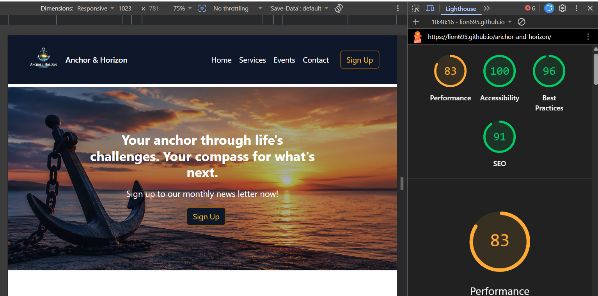
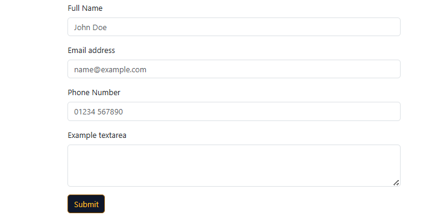
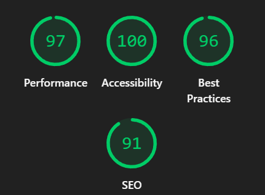

## Performance Testing and Fixes

### Initial Lighthouse Results

During testing, Lighthouse reported a relatively low Performance score of **83**.

To investigate the issue, I reviewed the Lighthouse recommendations and used the integrated AI assistant to identify potential improvements.

---

### Accessibility Improvements

One of the recommendations highlighted colour contrast issues affecting accessibility. To address this, I updated the styling of several interactive elements throughout the site, including:

- Navigation and action buttons
- Footer links
- Back-to-top button
- Form submit button

These changes improved colour contrast ratios and enhanced keyboard focus visibility, helping users navigate the site more effectively.

#### Button Styling Improvements

#### Accessibility Colour Adjustments

#### Footer Link Improvements

#### Back-to-Top Button Improvements

#### Back-to-Top Button Focus State

#### Form Submit Button Consistency Update

To maintain a consistent design language across the site, the form submit button was also updated to match the revised styling.

While these accessibility improvements increased the Accessibility score, they had only a minor impact on the overall Performance score.

---

### Hero Image Optimisation

After further investigation, I realised the hero image could be contributing significantly to the reduced performance score. The image had originally been generated using ChatGPT and, while visually effective, had not been optimised for web delivery.

The image was reprocessed and converted into a more efficient format while maintaining visual quality. This reduced the file size considerably and improved loading performance.

---

### Final Lighthouse Results

Following the hero image optimisation, the site's Lighthouse Performance score increased from **83** to **97**.

### Outcome

The testing process highlighted the importance of both accessibility and image optimisation:

- Improved colour contrast across interactive elements.
- Enhanced keyboard focus visibility.
- Maintained consistent visual styling throughout the site.
- Reduced hero image file size without noticeable quality loss.
- Increased Lighthouse Performance score from **83** to **97**.

This optimisation significantly improved the overall user experience by reducing page load times and increasing Lighthouse performance metrics.

## Button Styling
Below are the changes made to the button styling to maintain consistency throughout the site and provide a more accessible and user-friendly experience.

- Changes made to both the header and hero section buttons for a more accessible contrast.
- Changes to the services cards for a better contrast.
- Changes to form signup button to keep with the styling of the rest of the page.

## Changes to the Footer

- Added responsive links to the footer to navigate athrough the page.
- Social media links added and color coded to match the site.
- Link to my GitHub account added.

 

## HTML Validation

The examples below were taken from the source code of the deployed site on GitHub.